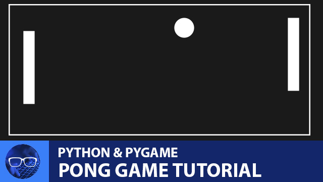

# Python Pong Game with Pygame

In this tutorial I am going to show you how to make Pong, a simple but very addictive game that was released back in 1973 by Atari. It is a very simple game by today's standards but it was a massive hit in its day. We are going to build this game using Python and the Pygame module.

Although Pong is a very simple game, it covers a lot of the aspects of computer game programming, like movement, control, collision detection, scoring, artificial intelligence and so on. If you learn how to program Pong you will be able to program a lot of other games as well.

  

# Full Instructions Video

Watch the video here: https://youtu.be/5NkTzvMchMw
